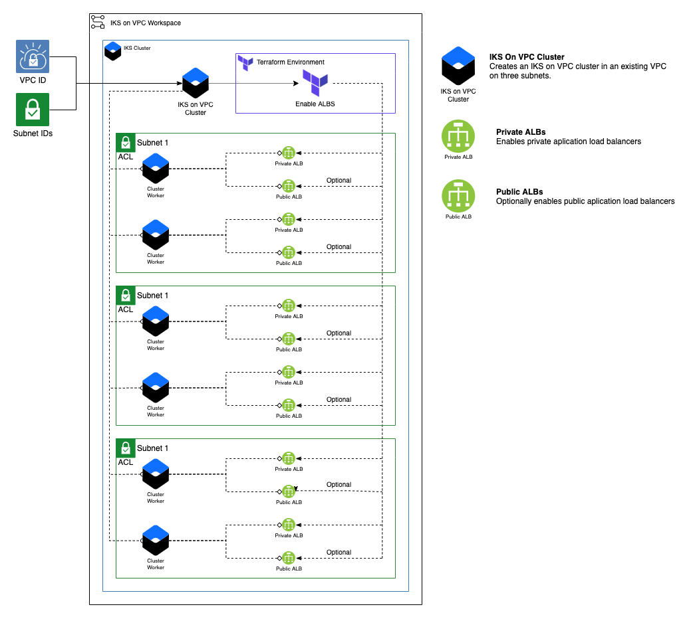
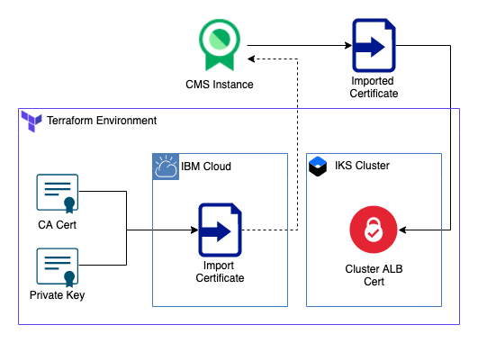

# Kubernetes cluster on VPC

This module creates an IKS Cluster on an existing VPC network and enables Private ALBs (Application Load Balancers). Optionally, it can also enable public ALBs.

Currently IBM Schematics only supports terraform version 0.11, but modules are included for 0.12.0.



## Additional Assets:

1. This can create a Cluster ALB Cert



### Table of Contents

1. [IKS on VPC Cluster](##iks%20%on%20%vpc%20cluster)
2. [Application Load Balancers](##Albs)
3. [Module Variables](##module%20variables)
4. [Outputs](##Outputs)
7. [As a Module in a Larger Architecture](##As-a-Module-in-a-Larger-Architecture)
5. [Additional Assets](##additional-assets)

------

## IKS on VPC Cluster

This module creates a multizone IKS on VPC cluster. Optionally, you can disable the public service endpoint on creation.

### More Info

- [Creating a Cluster on VPC](https://cloud.ibm.com/docs/containers?topic=containers-getting-started#vpc-classic-gs)
- [More about using the ibm_container_vpc_cluster terraform block in v0.12.0](https://ibm-cloud.github.io/tf-ibm-docs/v1.1.0/r/container_vpc_cluster.html)
- [More about using the ibm_container_vpc_cluster terraform block in v0.11.x](https://ibm-cloud.github.io/tf-ibm-docs/v0.23.0/r/container_vpc_cluster.html)

-----

### ALBs

This module enables either private ALBs or both public and Private ALBs on a cluster

The application load balancer (ALB) is an external load balancer that listens for incoming HTTP, HTTPS, or TCP service requests. The ALB then forwards requests to the appropriate app pod according to the rules defined in the Ingress resource.<sup>[1](https://cloud.ibm.com/docs/containers?topic=containers-ingress-about#alb-about)</sub>

- [About ALB Ingress](https://cloud.ibm.com/docs/containers?topic=containers-ingress-about#alb-about)
- [More about using the ibm_container_vpc_alb terraform block in v0.12.0](https://ibm-cloud.github.io/tf-ibm-docs/v1.1.0/r/container_vpc_alb.html)
- [More about using the ibm_container_vpc_alb terraform block in v0.11.x](https://ibm-cloud.github.io/tf-ibm-docs/v0.23.0/r/container_vpc_alb.html)

-----


## Module Variables


Variable            | Type    | Description                                                                   | Default
--------------------|---------|-------------------------------------------------------------------------------|--------
`ibmcloud_apikey`   | String  | IBM Cloud IAM API Key                                                         | 
`ibm_region`        | String  | IBM Cloud region where all resources will be deployed                         | `eu-gb`
`resource_group`    | String  | Name of resource group to provision resources                                 | `asset-development`
`generation`        | Number  | Generation of VPC architecture. **Currently IKS is only available in gen 1**  | `1`
`vpc_name`          | String  | Name of VPC where cluster is to be created                                    |
`subnet_ids`        | List    | List of subnet IDs [zone 1, zone 2, zone 3]                                   |
`cluster_name`      | String  | Name for the cluster to be created                                            |
`machine_type`      | String  | Machine type for the IKS Cluster                                              | `b2.4x16`
`worker_count`      | Number  | Number of workers per zone                                                    | `2`
`disable_pse`       | Boolean | Disable public service endpoint for cluster                                   | `false`
`only_private_albs` | Boolean | Enable only private albs                                                      | `false`


-----

## Outputs

- `cluster_name`: Name of the IKS on VPC Cluster
- `cluster_id`: ID of the IKS on VPC Cluster


-----

## As a Module in a Larger Architecture

Use the [`./module`](.module) folder to include this in a larger architecture

Declaring this Module:

### Using Default Variables

```
data ibm_resource_group resource_group {
    name = "<your resource group name>"
}

resource ibm_is_vpc vpc {
    name           = "${var.unique_id}-vpc"
    resource_group = "${data.ibm_resource_group.resource_group.id}"
    classic_access = "${var.classic_access}"
}


resource ibm_is_vpc_address_prefix subnet_prefix {
  count = 3

  name  = "${var.unique_id}-prefix-zone-${count.index + 1}"
  zone  = "${var.ibm_region}-${(count.index % 3) + 1}"
  vpc   = "${ibm_is_vpc.vpc.id}"
  cidr  = "${element(var.cidr_blocks, count.index)}"
}

resource ibm_is_subnet subnet {
  count           = 3

  name            = "${var.unique_id}-subnet-${count.index + 1}"
  vpc             = "${ibm_is_vpc.vpc.id}"
  zone            = "${var.ibm_region}-${count.index + 1}"
  ipv4_cidr_block = "${element(ibm_is_vpc_address_prefix.subnet_prefix.*.cidr, count.index)}"
  network_acl     = "${ibm_is_network_acl.multizone_acl.id}"
  public_gateway  = "${var.enable_public_gateway ? element(ibm_is_public_gateway.public_gateway.*.id, count.index) : null}"
}


module vpc_cluster {
    source             = "./<path to your code>"
    ibm_region         = "${var.ibm_region}"
    resource_group_id  = "${data.ibm_resource_group.resource_group.id}"
    vpc_id             = "${ibm_is_vpc.vpc.id}"
    subnet_ids         = "${ibm_is_subnet.subnet.*.id}"
    cluster_name       = "${var.unique_id}-cluster"
}
```

### Using Custom Variables

```
data ibm_resource_group resource_group {
  name = "<your resource group name>"
}

module vpc_cluster {
    source             = "./<path to your code>"
    ibm_region         = "<your value or reference>"
    resource_group_id  = "<your value or reference>"
    vpc_id             = "<your value or reference>"
    subnet_ids         = "<your value or reference>"
    cluster_name       = "<your value or reference>"
    machine_type       = "<your value or reference>"
    worker_count       = "<your value or reference>"
    disable_pse        = "<your value or reference>"
    only_private_albs  = "<your value or reference>"
}

```

## Additional Assets

1. [ALB Cert](###alb-cert)

----

### ALB Cert

This module uploads a certificate to CMS and uses that certificate to create an ALB Certificate for your IKS cluster. 
This asset requires an IBM Cloud Certificate Manager Instance, a Certificate, and a Certificate Private Key


#### Adding this file to your module

1. Create a `config` directory into your root module directory
2. Add you certificates to this directory
3. Move [alb_cert.tf](./alb_cert/alb_cert.tf) into your root module directory
4. Replace the file names in `ibm_certificate_manager_import` block in [alb_cert.tf](./alb_cert/alb_cert.tf) with your certificate file names
    - `content      = "${file("${path.module}/config/YOUR_CERT_NAME.pem")}"`
    - `priv_key     = "${file("${path.module}/config/YOUR_PRIVATE_KEY.key")}"`
4. Add the variables from [variables.tf](./alb_cert/variables.tf) into the `variables.tf` file of your root module directory
---
